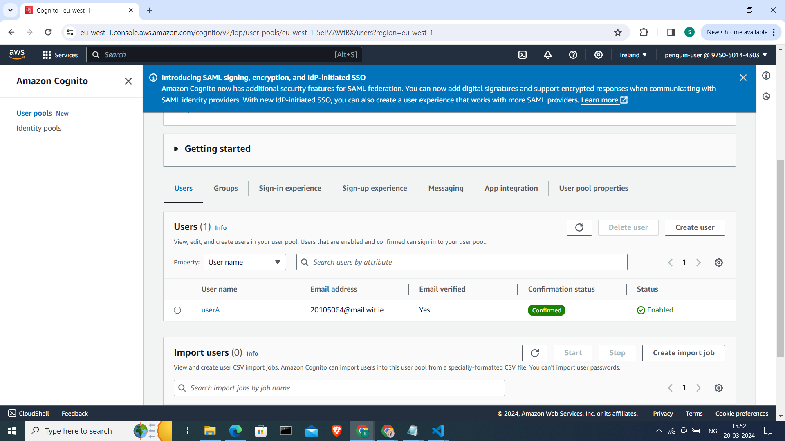

## Serverless REST Assignment.

__Name:__ Serene Babu

__Video demonstration:__ ..... URL of your Youtube video demonstration ....

This repository contains an implementation of a serverless REST API for the AWS platform. The CDK framework is used to provision its infrastructure. The API's domain context is movie reviews.

### API endpoints.

[ Provide a bullet-point list of the app's endpoints (excluding the Auth API endpoints you have successfully implemented in full. Omit those in the assignment specification that you did not complete.]
e.g.
 
+ POST /movies/reviews - add a movie review.
+ GET /movies/{movieId}/reviews - Get all the reviews for a movie with the specified id.
+ GET /movies/{movieId}/reviews?minRating=n - Get all the reviews for the film with the specified ID whose rating was higher than the minRating.
+ GET /movies/{movieId}/reviews/{reviewerName} - Get the review for the movie with the specified movie ID and written by the named reviewer.

[Include screenshots from the AWS management console (API Gateway service) that clearly show the deployed API ( ensure the font size is legible). ]

### Authentication (if relevant).

[Include a screenshot from the AWS management console (Cognito User Pools) showing a confirmed user account.]

### Independent learning (If relevant).

[ Briefly explain any aspects of your submission that required independent research and learning, i.e. typically related to the higher grade bands. State the source files that have evidence of this.

